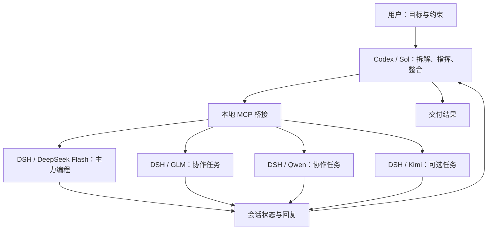

# Codex × DSH MCP

**让 Codex 的 Sol 级模型做指挥，让 DeepSeek Flash 做编程主力，GLM、Qwen、Kimi 按任务协作。**

一个轻量的本地 MCP 桥接，把 Codex 的规划能力和 DeepSeek Harness（DSH）的多模型执行能力接起来。当前版本 **v1.1.1**。

你在 Codex 中交代目标，Sol 模型理解需求、划分任务、确定接口，再通过 MCP 在 DSH 中建立独立聊天，把具体工作交给合适的模型。结果回到 Codex，由主控检查关键边界、整合改动并向你汇报。

## 为什么这样分工

架构决策和局部实现对模型的要求不同。项目采用以下分工策略，把主控额度集中在需求理解、跨模块判断和最终整合，把大量范围明确的编程工作交给执行模型。

| 角色 | 模型 | 本项目中的分工 |
| --- | --- | --- |
| 指挥 / 架构师 | Codex 中的 Sol 级模型，例如 GPT-6.1-Sol | 澄清目标、拆任务、定义输入输出、安排依赖、审查关键变更、整合交付 |
| 主力程序员 | DeepSeek Flash | 明确边界的功能实现、局部修复、代码修改和调试；作为默认执行选择 |
| 协作成员 | GLM | 承接独立实现，或对具体方案和改动给出第二视角 |
| 协作成员 | Qwen | 按任务处理脚本、文本整理、文档及独立代码工作 |
| 可选成员 | Kimi | 按任务阅读材料、整理上下文，或执行其他独立工作 |

这是项目的使用策略，不是模型能力排行榜。实际派工取决于可用模型、项目需求和执行反馈；本项目没有提供模型横向评测或额度节省比例。



## 已实现的能力

当前的指挥工作由 Codex 对话中的主控模型完成，MCP 提供执行接口。可以创建多个独立 DSH 聊天、指定模型和推理强度、发送任务、读取结果以及补充指令。不同聊天保留各自的模型选择，MCP 不修改 DSH 全局默认模型。

自动任务路由、持久任务队列、无人值守调度、自动合并代码和角色之间自主对话尚未实现。多个聊天操作同一目录时，应由主控安排文件边界；存在冲突风险的任务使用不同目录或 Git worktree。

### 八个 MCP 工具

| 工具 | 用途 |
| --- | --- |
| `dsh_info` | 查看桥接状态、模型 ID 和各模型支持的推理强度 |
| `dsh_chat` | 创建空聊天或立即发任务；选择项目、模型、推理强度；继续聊天或插队补充要求 |
| `dsh_result` | 读取状态与文本回复，省略推理过程和工具日志 |
| `dsh_projects` | 列出 DSH 项目 |
| `dsh_project_create` | 创建目录并注册项目，也可使用已有目录 |
| `dsh_project_delete` | 移除项目注册，保留磁盘文件与聊天记录 |
| `dsh_chats` | 查看聊天 ID、标题、目录及归档状态，可按项目筛选 |
| `dsh_chat_archive` | 归档聊天并保留历史；运行中默认拒绝，可显式指定 `stop_activity: true` |

## 快速安装

### 前提

- Node.js `>=22.19.0`、npm，以及带 MCP 支持的 Codex。
- 能正常启动的 DSH。已在 Windows 上验证官方 DeepSeek Harness 的连接、发送任务、读取回复和归档流程。
- DSH 中已经配置可用模型和相应凭据。本仓库不附带模型服务或凭据。

### 1. 下载并安装依赖

```powershell
git clone https://github.com/guochengran464-byte/codex-dsh-mcp.git
cd codex-dsh-mcp
npm ci
Copy-Item config.example.json config.json
```

编辑本机 `config.json`，填入绝对路径。例如：

```json
{
  "port": 43129,
  "stateDir": "D:/agent-work/dsh-mcp-state",
  "defaultCwd": "D:/agent-work/dsh-workers"
}
```

`stateDir` 放桥接密钥；`defaultCwd` 是未指定项目或目录时，执行聊天使用的工作目录。`config.json` 已加入 Git 忽略规则。

### 2. 初始化目录和桥接密钥

首次安装时，在仓库目录执行以下 PowerShell 命令。密钥直接写入本机文件，不打印到终端；已有密钥时拒绝覆盖。

```powershell
@'
import { readFile, mkdir, writeFile } from 'node:fs/promises';
import { randomBytes } from 'node:crypto';
import { join } from 'node:path';
const config = JSON.parse(await readFile('config.json', 'utf8'));
await mkdir(config.stateDir, { recursive: true });
await mkdir(config.defaultCwd, { recursive: true });
await writeFile(join(config.stateDir, 'token'), randomBytes(32).toString('hex'), { flag: 'wx', mode: 0o600 });
'@ | node --input-type=module
```

### 3. 在 DSH 中加载桥接插件

在实际使用的 Profile 的 `cordis.patch.yml` 末尾追加以下条目。桌面版通常使用 `~/.dsh/profiles/desktop/cordis.patch.yml`，以实际 Profile 为准。

把 `name` 替换为本仓库 `dsh-plugin.mjs` 的绝对路径，其他配置保持与 `config.json` 一致。Windows YAML 路径建议使用 `/`。

```yaml
# BEGIN CODEX DSH MCP
- insert:
    - id: codex-dsh-mcp
      name: "D:/agent-work/codex-dsh-mcp/dsh-plugin.mjs"
      config:
        port: 43129
        allowedProviders: ["your-provider-id"]
        stateDir: "D:/agent-work/dsh-mcp-state"
        defaultCwd: "D:/agent-work/dsh-workers"
# END CODEX DSH MCP
```

`allowedProviders` 填入你允许 MCP 使用的实际提供方 ID（可在 DSH 模型配置中查看），不要照抄示例值。未配置白名单时插件拒绝启动；只读取并调用白名单内的提供方，不会自动回退。

重启 DSH，保持它运行。

### 4. 注册到 Codex

```powershell
codex mcp add dsh -- node "D:/agent-work/codex-dsh-mcp/server.mjs"
```

替换为实际仓库路径。重新打开 Codex 后，调用 `dsh_info` 确认 `connected: true`，并查看当前可用模型。

## 给主控的示例指令

在 Codex 中选择你要使用的 Sol 级模型，再粘贴下面的指令，并补上实际任务：

> 你负责架构、任务拆解和最终整合。先通过 dsh_info 读取模型目录。范围明确的编程任务默认交给 DeepSeek Flash；适合独立推进的工作可分给 GLM、Qwen 或 Kimi。按模型实际支持的档位选择推理强度。
>
> 每项任务交代目标、工作目录、允许修改的文件、输入输出、验收要求和需要返回的结果。存在依赖时先完成前置任务；并行工作划分文件边界，必要时使用独立目录。通过 dsh_chat 建立聊天并派工，记录 session_id 和 after_seq，再用 dsh_result 收集结果。
>
> 有补充要求时使用 mode: steer 插队；普通后续任务使用 queue。遇到权限请求就告知我。审查重点放在任务边界、接口、结果与明显风险，避免重复审查已解决的问题。汇总改动和仍需处理的事项。
>
> 我的任务是：……

### 创建主力编程聊天

传给 `dsh_chat`：

```json
{
  "title": "主力：实现登录接口",
  "model": "deepseek-flash",
  "reasoning_effort": "default",
  "cwd": "D:/agent-work/my-project",
  "prompt": "实现登录接口。只修改 src/auth 下的文件。先阅读现有接口约定，完成后返回修改文件、行为变化和未解决的问题。"
}
```

协作聊天可使用已配置提供方下的模型，例如 `glm-5.3`、`qwen3.8-flash`、`kimi-k3`。模型 ID 与档位可能变化，始终以 `dsh_info` 的实时目录为准。

### 读取结果与继续工作

`dsh_chat` 立即返回 `session_id` 和 `after_seq`。将它们传给 `dsh_result`，状态为 `running` 时稍后再读取。`after_seq` 用于排除早先的回复。

省略 `prompt` 会创建空聊天，不发送模型请求。传 `project_id` 可以把新聊天放入已有 DSH 项目，与 `cwd` 二选一。

模型、推理强度、项目、目录和名称参数仅用于新聊天；继续聊天时传 `session_id`、`prompt` 和可选 `mode`。归档后的聊天需要先在 DSH 中恢复。

### 排队与插队

```json
{
  "session_id": "dsh_chat 返回的会话 ID",
  "prompt": "补充要求：接口需要保持向后兼容，先处理这个约束。",
  "mode": "steer"
}
```

`mode: "queue"` 是默认行为，等待当前轮完成；`"steer"` 使用 DSH 原生插队机制，把补充指令交给当前轮。接入时机由 DSH 决定，不保证立即取消正在进行的模型请求或工具调用。

### 推理强度

使用 `dsh_info` 返回的 `reasoning.efforts[].id`。`reasoning_effort: "default"` 使用模型自身默认强度；省略所有模型选项时沿用 DSH 当前默认选择。传入不支持的值会报错，不会静默替换模型或提供方。

## 连接方式与边界

- `server.mjs` 是 Codex 启动的 stdio MCP 服务；`dsh-plugin.mjs` 运行在 DSH 内，通过其会话、项目和模型服务执行操作。
- 两者通过仅监听 `127.0.0.1` 的 HTTP 桥接通信，使用 `stateDir/token` 中的随机密钥认证。
- 模型目录读取和模型请求仅允许本机 `allowedProviders` 白名单内的提供方。公开代码不绑定任何特定模型服务渠道。
- Codex 主控使用 Codex 自己的模型与订阅；执行模型使用 DSH 已配置的模型服务。桥接不会把 Plus 订阅转成 API 额度，也不会替你购买执行额度。
- DSH 中的文件、工具和权限设置继续生效，需要批准的操作仍由用户在 DSH 中处理。
- 当前依赖 DSH 的宿主服务接口，包括会话局部模型选择。DSH 升级后建议先检查连接和一次简单任务；不同发行版和未来版本的兼容性需实际验证。
- `dsh_chats` 默认返回最多 20 条，`limit` 最大为 100；`include_archived: true` 查看归档，`bridge_only: true` 仅列出桥接创建的聊天。

## 本地检查

```powershell
node --check server.mjs
node --check dsh-plugin.mjs
node check-mode.mjs
```

`check-mode.mjs` 检查提供方白名单、默认排队、显式排队、插队及无效模式，使用隔离桥接和模拟的 DSH 投递接口，不调用模型 API。它不替代真实 DSH 的端到端检查。

## 版本

| 版本 | 内容 |
| --- | --- |
| `v1.0` | 模型信息、发送任务、读取结果的最小桥接 |
| `v1.1` | 项目管理、聊天列表与归档、每个新聊天独立选择模型和推理强度 |
| `v1.1.1` | 新增 `queue` / `steer` 排队与插队 |

`connection-check.json` 是经过路径和提供方脱敏的 v1.0 历史连接样例。本机配置、密钥、依赖安装目录和原配置备份不应上传。

## 移除

执行 `codex mcp remove dsh`，删除实际 Profile 中 `BEGIN CODEX DSH MCP` 到 `END CODEX DSH MCP` 之间的桥接条目，再重启 DSH。仅删除桥接条目，保留其他插件配置。

## Contributors

- [Guo Chengran (@guochengran464-byte)](https://github.com/guochengran464-byte) — project creator and maintainer
- ChatGPT — AI-assisted architecture, coding, review, and documentation

## 许可证

本项目采用 [MIT License](LICENSE)。
